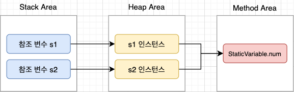
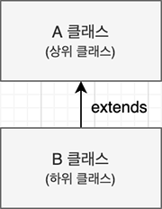

# 클래스 변수와 클래스 메소드
## 클래스 변수
클래스 내에 선언된 변수 앞에 **static 키워드**를 붙이면 인스턴스 변수가 아닌 **클래스 변수**가 된다.<br/>
```java
static int num = 100;
```
이 변수는 **클래스 전반에서 공유하여 사용할 수 있는 변수**로 다른 말로 **'정적 변수'**라고도 한다.<br/>
인스턴스 변수와 달리 인스턴스를 생성할 때마다 메모리 공간에 할당되는게 아니라, 클래스 정보가 가상 머신에 의해 읽히는 순간(클래스 로딩) **딱 한 번 메모리 공간에 할당되고 초기화**된다. **모든 인스턴스가 이 클래스 변수를 공유**한다.

```java
class StaticVariable {
    static int num = 1;

    public int increaseNum() {
        return ++num;
    }
}

public class StaticTest {
    public static void main(String[] args) {
        StaticVariable s1 = new StaticVariable();
        StaticVariable s2 = new StaticVariable();

        System.out.println(s1.increaseNum()); // 2
        System.out.println(s1.increaseNum()); // 3

        System.out.println(s2.increaseNum()); // 4

        System.out.println(StaticVariable.num); // 4
    }
}
``` 
 
메모리 관점에서 살펴보면 인스턴스들이 클래스 변수를 공유하고 있다.<br/>


### 클래스 변수를 사용하는게 더 나은 경우
**인스턴스 간에 데이터 공유가 필요한 상황**에서 클래스 변수를 선언한다.

## 클래스 메소드
클래스 내에 정의된 메소드에 **static 키워드**를 붙이면 **클래스 메소드**가 된다.

```java
class StaticMethod {
    public static int sum(int num1, int num2) {
        return num1 + num2;
    }
}

public class StaticTest {
    public static void main(String[] args) {
        int sumNum = StaticMethod.sum(1, 2);
        System.out.println(sumNum); // 3
    }
}
```

클래스 메소드 역시 **인스턴스의 생성과 무관하게 호출** 할 수 있다.<br/>
클래스 메소드는 **외부에 기능을 제공하기 위한 메소드**로, **인스턴스에 속하지 않으므로 인스턴스 변수 값을 참조하거나 수정 할 수 없고 인스턴스 메소드 역시 호출 할 수 없다.**<br/>
다만, 같은 클래스에 정의되어 있는 다른 **클래스 메소드**나 성격이 동일한 **클래스 변수**에는 **접근이 가능**하다.

### 클래스 메소드를 사용하는게 더 나은 경우
클래스 메소드의 특성에 맞게 **인스턴스 변수를 사용하지 않는 경우**에 메소드가 인스턴스에 속할 이유가 없으므로 클래스 메소드로 정의해 사용하는 것이 좋다.


## static 응용 - 싱글톤 패턴
### 싱글톤 패턴이란?
싱글톤 패턴은 메모리 공간에 **인스턴스를 한 번만 생성**하고, 프로그램 전역에서 **인스턴스를 공유하여 사용**하는 디자인 패턴이다. <br/>
클래스 변수를 통해 이를 구현할 수 있다.
```java
class Singleton {
    // 클래스가 로딩 될 때 인스턴스를 딱 한 번 생성한다.
    private static final Singleton instance = new Singleton();
    private static int cnt = 0;

    // 생성자 메소드를 private 접근 제어자로 접근의 제한을 두어 
    // 외부에서 인스턴스를 생성하지 못하도록 막아둔다.
    private Singleton(){
        System.out.printf("인스턴스가 %d번 생성되었습니다.\n", ++cnt);
    }

    // 인스턴스는 오직 getInstance()를 통해서만 참조할 수 있다.
    public static Singleton getInstance(){
        return instance;
    }
}

public class SingletonTest {
    public static void main(String[] args) {
        Singleton s1 = Singleton.getInstance();
        Singleton s2 = Singleton.getInstance();

        // 동등 비교 연산자는 인스턴스의 해시 코드 값을 비교한다.
        System.out.println("s1과 s2는 " + (s1 == s2 ? "동일한" : "다른") + " 인스턴스 입니다.");
    }
}

/*
인스턴스가 1번 생성되었습니다.
s1과 s2는 동일한 인스턴스입니다.
*/
```


## System.out.println()
- ``System`` : System 클래스는 자바에서 제공하는 클래스로 java.lang 패키지에 있다.<br/>
원칙적으로는 ``java.lang.System.out.println();``로 호출해야 하지만 컴파일러가 ``import java.lang.*``을 자동으로 삽입해주기 때문에 생략이 가능하다.
- ``out`` : out 변수는 System 클래스 내에 아래와 같이 선언되어 있는 클래스 변수다.

```java
public final class System extends Object {
   public static final PrintStream out; // 참조변수 out
   // ... 생략 ...
}
```
- ``println`` : println은 PrintStream 클래스의 인스턴스 메소드이다.

<br/>

⇒ System.out.println()은 System 클래스에 있는 클래스 변수 out이 참조하는 인스턴스의 println 메소드를 호출하는 코드다.


# 메소드 오버로딩
자바에서 메소드를 호출 할 때는 두 가지 정보를 참조하여 호출할 메소드를 찾는다.
1. 메소드의 이름
2. 메소드의 매개변수 정보

오버로딩은 선언된 **매개변수의 정보(매개변수의 수 또는 자료형)가 다르면 동일한 이름의 메소드 정의를 허용**하는 것이다.<br/>
생성자 또한 오버로딩을 통해 다른 매개변수를 받는 여러개의 생성자를 만들 수 있다.
```java
public class Animal {
    private String name;
    private int age;

    public Animal() {
        // this를 통해 다른 생성자를 호출 할 수도 있다.
        // this("puppy", 2);
    }

    public Animal(String name) {
        this.name = name;
    }

    public Animal(String name, int age) {
        this.name = name;
        this.age = age;
    }
}
```

# String 클래스
## 문자열을 생성하는 두가지 방법의 차이
### 1. 문자열 리터럴을 통해 인스턴스를 생성하는 방식
```java
String str1 = "Hello";
String str2 = "Hello";
System.out.println("str1과 str2는 " + (str1 == str2 ? "동일한" : "다른") + " 인스턴스 입니다.");
// str1과 str2는 동일한 인스턴스 입니다.
```
문자열 리터럴로 생성한 인스턴스는 JVM의 Heap 영역의 내부에 존재하는 **String Pool이라는 상수 풀에 인스턴스를 저장**하고,<br/>
만약 **문자열의 내용이 같은 경우 동일한 인스턴스를 참조하도록 처리**한다. 생성되는 인스턴스의 수를 줄여 **메모리 공간을 더 효율적으로 사용하기 위함**이다.<br/>
동일한 인스턴스를 참조하기 때문에 만약 str1의 내용이 변하면 str2에 영향이 가지 않을까란 의문이 생길 수 있다.<br/>
String은 **Immutable Object(불변 객체)이기 때문에 문자열의 내용이 변하면 새로운 인스턴스를 생성**하고, 그 메모리 공간의 주소를 참조하므로 인스턴스를 공유해서 생기는 문제는 없다.

### 2. new 키워드로 String 클래스의 인스턴스를 생성하는 방식
```java
String str3 = new String("Java");
String str4 = new String("Java");
System.out.println("str3과 str4는 " + (str3 == str4 ? "동일한" : "다른") + " 인스턴스 입니다.");
// str3과 str4는 다른 인스턴스 입니다.
```
new 키워드로 생성한 인스턴스는 문자열 리터럴과 달리 String Pool에 저장되지 않는다.<br/>
매번 **새로운 인스턴스를 생성**하기 때문에 동등 비교 연산자(==)로 해시 코드 값을 비교하면 false가 나온다. 때문에 **문자열의 내용을 비교하기 위해서는 equals 메소드**를 사용해야한다.

## StringBuffer, StringBuilder 클래스
문자열을 연결할 때 String 클래스에서 제공하는 concat 메소드를 사용해 문자열을 연결 시킬 수 있다. <br/>
```java
"Hello".concat("Java").concat("Programing");
```
하지만 문자열은 불변하기 때문에 결국 **concat 메소드로 문자열을 연결할 때마다 새로운 인스턴스가 생성**되는 것이고 이는 **메모리의 낭비**로 이어진다.
이를 해결하기 위해 나온 것이 **StringBuffer와 StringBuilder 클래스**이다.<br/><br/>

StringBuffer와 StringBuilder 클래스는 **내부적으로 변경 가능한 char[]를 변수**로 가지고 있다.<br/>
이 두 클래스를 사용하면 기존에 사용되던 **char[] 배열이 확장**되는 것이므로 **추가 메모리를 사용하지 않는다.**<br/>
두 클래스의 차이는 StringBuffer는 멀티 스레드 환경에서 안전하게 변경 되는 것이 보장되는 반면 StringBuilder는 그렇지 않다는 점이다.<br/>
StringBuffer보다 **StringBuilder의 실행 속도가 더 빠르므로** 멀티 스레드 프로그램이 아니라면 StringBuilder를 사용하는 것이 더 좋다.

```java
StringBuilder sb = new StringBuilder("Hello");
sb.append("Java").append("Programing");

// toString 메소드를 호출하면 문자열로 변환된다.
System.out.println(sb.toString()); // HelloJavaPrograming
```

# 배열
배열은 자료형이 같은 둘 이상의 값을 저장 할 수 있는 메모리 공간이다.
```java
int[] nums = new int[10]; 
// int형 데이터를 10개 저장할 수 있는 배열을 선언하고 nums 참조 변수가 그 값을 참조한다.
```

요소에 값을 할당할 때는 아래와 같이 배열의 index 값으로 배열의 요소에 접근한다. index는 0부터 시작한다.
```java
// arr[인덱스 번호] = 요소값;
nums[0] = 10;
nums[1] = 99;
```

## 배열 초기화
배열을 선언하면 그와 동시에 각 요소의 값이 **자료형에 맞게 초기화**된다. (정수는 0, 실수는 0.0, 객체는 null)
```java
int[] nums = new int[10]; // 배열의 모든 요소 0으로 초기화
String[] strs = new String[10]; // 배열의 모든 요소 null로 초기화
```

원하는 값으로 요소를 초기화 할 수도 있다.
```java
// 이때 개수는 유추가 가능하므로 생략해야 한다.
int[] nums1 = new int[]{1, 2, 3};

// !!! Error !!! 만약 개수를 함께 쓰면 에러가 발생한다.
int[] nums2 = new int[3]{1, 2, 3};

// new int[]를 생략해도 된다.
int[] nums3 = {1, 2, 3};
```

## 배열 복사하기
배열도 참조 자료형이기 때문에 **참조 값의 복사**가 이뤄진다.
```java
int[] src = {1, 1, 1};
int[] dest = src;

// 원본 배열의 값이 바뀌면
src[0] = 9;

// 대상 배열의 값도 바뀐다. (서로 같은 인스턴스를 참조한다.)
System.out.println(dest[0]); // 9
```

배열의 값을 복사하고 싶을 때는 for문으로 배열의 요소를 순회하여 복사하는 방법도 있지만,<br/> 
**``java.lang.System`` 클래스의 ``arraycopy()``**를 이용하면 간단하게 배열의 복사를 할 수 있다. <br/>
```java:title=java.lang.System
// 배열 src의 srcPos에서 배열 dest의 destPos로 length 길이만큼 복사
public static void arraycopy(Object src, int srcPos, Object dest, int destPos, int length)
```
```java
int[] src = {1, 1, 1};
int[] dest = new int[3];
// 배열 복사
System.arraycopy(src, 0, dest, 0, src.length);

// 원본 배열의 값이 바뀌어도
src[0] = 9;

// 대상 배열은 안전하다. (서로 다른 인스턴스를 참조한다.)
System.out.println(dest[0]); // 1
```

## enhanced for문
자바5부터 제공되는 enhanced for문을 사용하면 더 간단하게 배열의 요소를 순회 할 수 있다.
```java
/*
for(변수 : 배열) {
   반복 실행문
}
*/

String[] arr = {"안녕", "하세요", "자바", "공부중"};

for(String s : arr) {
   System.out.println(s);
}
```

## 다차원 배열
배열의 논리적 메모리 구조가 **2차원 이상의 형태를 보이는 배열**을 가리켜 **다차원 배열**이라 한다.
### 이차원 배열
```java
int[][] arr = new int[3][4];
// 3행 4열의 이차원 배열

// 참조변수
//  arr ---> arr[0] ---> ⎕⎕⎕⎕
//           arr[1] ---> ⎕⎕⎕⎕
//           arr[2] ---> ⎕⎕⎕⎕
```
다차원 배열도 선언과 동시에 원하는 값으로 요소를 초기화 할 수 있다.
```java
int[][] arr = {{1}, {2, 3}, {4, 5, 6}};

for(int[] i : arr) {
   for(int j : i) {
      System.out.printf(String.valueOf(j));
   }
   System.out.println();
}

/*
1
23
456
*/
```

# 클래스의 상속
클래스를 상속 받으면, 상속 대상이 되는 클래스의 멤버 변수와 메소드를 사용할 수 있다.<br/>
클래스의 상속은 코드의 재활용이 아닌 **연관된 일련의 클래스들에 대한 공통적인 규약을 정의**하기 위한 문법이다.<br/>
상속을 구현할 때는 **extends 예약어를 사용하여 상속 받을 클래스를 명시**하면 된다. extends는 **"연장, 확장하다"**을 의미한다.<br/>
즉, 상속은 **기존의 클래스에 속성과 기능을 추가하여 확장된 새로운 클래스를 정의**하는 일이다.<br/>
```java
class B extends A {}
// B클래스는 A클래스를 상속받는다.
```
상속을 그림으로 표현하면 아래와 같다. (* **화살표 방향은 상속**을 의미한다. 방향에 유의한다.)


<br/>

상속 관계의 A 클래스와 B 클래스는 다양한 용어로 표현할 수 있다.
- A 클래스 **(상속의 대상이 되는 클래스)** : 상위 클래스, 기초 클래스, 부모 클래스
- B 클래스 **(상속을 하는 클래스)** : 하위 클래스, 유도 클래스, 자식 클래스

<br/>

자바에서는 **단일 상속**만을 지원한다. 한 클래스가 상속 받을 수 있는 최대 클래스의 수는 한 개이다.

## 상속 관계인 클래스의 인스턴스 생성 과정
하위 클래스의 인스턴스를 생성하면 **상위 클래스의 생성자가 먼저 호출**되고, 생성자가 호출되면서 **상위 클래스의 멤버 변수가 메모리 공간에 할당**된다. 상속을 받은 하위 클래스에서 상위 클래스의 멤버 변수와 메소드에 접근 할 수 있는 이유 역시 이때문이다.
```java 
class SuperCls {
    private String name;

    public SuperCls(){
        System.out.println("상위 클래스 생성자 호출");
        this.name = "Java";
    }

    public String getName() {
        return name;
    }
}

class SubCls extends SuperCls {
    public SubCls() {
        System.out.println("하위 클래스 생성자 호출");
        System.out.println("상위 클래스 멤버 변수에 접근하기 : " + super.getName());
    }
}

public class Inheritance {
    public static void main(String[] args) {
        new SubCls();
    }
}

/*
상위 클래스 생성자 호출
히위 클래스 생성자 호출
상위 클래스 멤버 변수에 접근하기 : Java
*/
```

<br/>

상위 클래스의 생성자가 먼저 호출되는 이유는 컴파일러에 의해 상위 클래스의 기본 생성자를 호출하는 ``super();`` 코드가 자동으로 추가되었기 때문이다.
- ``super`` : 하위 클래스에서 **상위 클래스에 접근 할 때 사용**하는 키워드로, **상위 클래스의 참조 값**을 알고 있다.<br/>

```java
class SubCls extends SuperCls {
    public SubCls() {
        // 호출할 상위 클래스의 생성자를 명시하지 않으면 상위 클래스의 기본 생성자가 호출된다.
        super();
        System.out.println("하위 클래스 생성자 호출");
        System.out.println("상위 클래스 멤버 변수에 접근하기 : " + super.getName());
    }
}
```

<br/>

만약 상위 클래스의 생성자를 호출해 상위 클래스를 초기화하고 싶다면, **super 예약어로 상위 클래스의 생성자를 명시적으로 호출**하면 된다.
```java
class Item {
    private String name;
    private int price;

    public Item(String name, int price) {
        this.name = name;
        this.price = price;
    }
}

class Book extends Item {
    private String author;

    public Book(String name, int price, String author) {
        // super 예약어로 명시적으로 상위 클래스의 생성자를 호출해 초기화한다.
        super(name, price);
        this.author = author;
    }
}

public class Inheritance {
    public static void main(String[] args) {
        new Book("달러구트 꿈 백화점", 13000, "이미예");
    }
}
```

## 메소드 오버라이딩
메소드 오버라이딩이란 **상위 클래스에 정의된 메소드를 하위 클래스에서 재정의**하는 것을 말한다.<br/>
오버라이딩을 하기 위해서는 **반환형, 메소드 이름, 매개변수 개수, 매개변수 자료형이 반드시 같아야 한다.**

```java
class Item {
    private String name;
    private int price;

    public Item(String name, int price) {
        this.name = name;
        this.price = price;
    }

    public int getPrice() {
        return price;
    }
}

class Book extends Item {
    private String author;

    public Book(String name, int price, String author) {
        super(name, price);
        this.author = author;
    }

    // 메소드 오버라이딩
    @Override
    public int getPrice() {
        // 책은 1000원의 수수료가 더 붙는다.
        return super.getPrice() + 1000;
    }
}

public class Inheritance {
    public static void main(String[] args) {
        Item book = new Book("달러구트 꿈 백화점", 13000, "이미예");
        System.out.println("책 가격 : " + book.getPrice()); 
        // 책 가격 : 14000
    }
}
```

## instatncof 연산자
```
${ref} instanceof ${ClassName}
```
참조변수가 참조하는 **인스턴스의 '클래스'**나 참조하는 인스턴스가 **'상속하는 클래스'**인지를 묻는 연산자이다.
```java
class SuperCls {...}
class SubCls extends SuperCls {...}

public class Inheritance {
    public static void main(String[] args) {
        SuperCls sub = new SubCls();

        System.out.println(sub instanceof SubCls); // true
        System.out.println(sub instanceof SuperCls); // true
    }
}

```

## 다형성
다형성은 **하나의 코드가 여러 자료형으로 구현되어 실행되는 것**을 말한다.<br/>
다형성을 이용해 상위 클래스에서 공통 메소드를 제공하고 하위 클래스가 이를 오버라이딩하는 방식으로 구현하면 코드의 양이 줄어들고 유지보수가 편리해진다. 또한 여러 클래스를 하나의 클래스(상위 클래스)로 선언하여 처리 할 수 있고, 다형성에 의해 각 클래스의 여러 가지 구현을 실행할 수 있어 프로그램을 쉽게 확장 할 수 있다.
```java
/* 공통된 클래스 정의 */
class Item {
    public String buy() {
        return "아이템을 구매한다.";
    }
}

/* 책 */
class Book extends Item {
    @Override
    public String buy() {
        return "책을 구매한다.";
    }
}

/* 영화 */
class Movie extends Item {
    @Override
    public String buy() {
        return "영화를 구매한다.";
    }
}

public class Inheritance {
    public static void main(String[] args) {
        Item book = new Book();
        Item movie = new Movie();

        Item[] items = {book, movie};

        for(Item item : items) {
            System.out.println(item.buy());
        }
    }
}

/*
책을 구매한다.
영화를 구매한다.
*/
```

## 클래스와 메소드의 final 선언
### 클래스의 final 선언
다른 클래스가 **해당 클래스를 상속할 수 없다.**
```java
public final class MyLastCLS {...}
```

### 메소드의 final 선언
다른 클래스에서 **해당 메소드를 오버라이딩 할 수 없다.**
```java
class Simple {
    public final void func(int n) {...}
}
```

# Reference
- [윤성우의 열혈 Java 프로그래밍](http://www.yes24.com/Product/Goods/43755519?OzSrank=1)
- [Do it! 자바 프로그래밍 입문](http://www.yes24.com/Product/Goods/62281686?OzSrank=7)