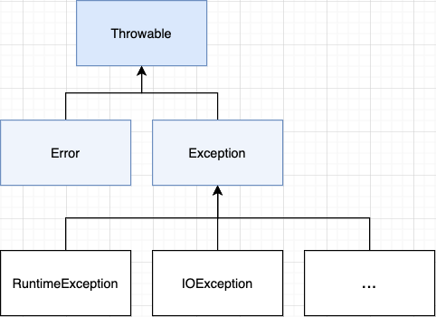

# 추상 클래스
하나 이상의 **추상 메소드를 갖는 클래스를 가리켜 추상 클래스**라고 한다. <br/>
추상 메소드는 함수의 구현부가 없다. ``abstract`` 예약어를 사용해 선언한다.
```java
abstract class Animal { // 추상 클래스
    public abstract String cry(); // 추상 메소드

    public String sayHello() {
        return "Hello";
    }
}
```
추상 클래스는 **메소드의 몸체가 완성되지 않았기 때문에 인스턴스를 생성할 수 없다.** 상위 클래스로 디자인 된 것으로 **하위 클래스가 상속해서 사용하는 것이 목적**이다.<br/>
추상 클래스 내 구현된 메소드는 하위 클래스에서 공통으로 사용할 코드로, 하위 클래스에서 재정의 할 수도 있다.<br/>
반면 추상 메소드는 하위 클래스가 어떤 클래스냐에 따라 구현 코드가 달리지는 메소드이다. 메소드만 남겨 두고 구현은 하위클래스에게 위임한 것이다.


# 인터페이스(Interface)
인터페이스란 다른 클래스를 작성할 때 **기본이 되는 틀을 제공**하면서, 다른 클래스 사이의 중간 매개 역할까지 담당하는 일종의 추상 클래스를 의미한다. 
인터페이스는 **추상 메소드**와 **상수**로만 이루어져 있다.
```java
interface Animal { // class 대신 interface라는 선언을 붙인다.
    int CODE = 9999; 
    // public static final int CODE = 9999 와 같음

    String cry(); // 메소드는 몸체 없이 세미콜론으로 마무리한다.
    // public abstract String cry(); 와 같음
}
```
인터페이스에 선언되는 메소드는 모두 **추상 메소드**이기 때문에 ``public abstract``를 생략할 수 있고,<br/>
모든 필드는 **상수**이기 때문에 ``public static final``을 생략해도 **컴파일러가 자동으로 이를 추가**해준다.

## 인터페이스의 구현
```java
class B implements A {...}
// B 클래스가 인터페이스 A를 구현한다.
```
인터페이스는 클래스가 아니기 때문에 직접 인스턴스를 생성 할 수 없다.<br/> 
**클래스의 정의에 의해 구현될 뿐**이며, 인터페이스를 **구현한 클래스의 참조 변수로 선언이 가능**하다.
```java
interface Animal {
    int CODE = 9999;
    String cry();
}

class Dog implements Animal {
    @Override
    public String cry() {
        return "멍멍";
    }
}

public class AbstractTest {
    public static void main(String[] args) {
        // 인터페이스형 참조변수 선언 가능
        Animal dog = new Dog();
        System.out.println(dog.cry()); // 멍멍
    }
}
```

### 클래스의 인터페이스 구현의 특징
1. 구현할 인터페이스를 명시할 때 키워드 ``implements``를 사용한다.
2. 한 클래스는 **둘 이상의 인터페이스를 동시에 구현할 수 있다.**
3. **상속과 구현은 동시에 가능하다.**
4. **인터페이스의 형을 대상으로 참조변수의 선언이 가능**하다.
5. 인터페이스의 추상 메소드와 이를 구현하는 메소드 사이에 **오버라이딩 관계가 성립**한다.

## 인터페이스를 사용하는 이유
인터페이스의 사전적 의미는 연결점 또는 접점으로, **둘 사이를 연결하는 매개체**를 뜻한다.<br/>
인터페이스는 클라이언트 프로그램에 어떤 메소드를 제공하는지 미리 알려주는 **표준 명세서의 역할**을 한다.<br/>
인터페이스를 구현한 클래스의 이름만 알면 **내부의 구현이 어떻게 이루어졌는지 알 필요 없이 사용이 가능**하게 된다.

## 디폴트 메소드와 정적 메소드
자바8부터는 인터페이스의 활용도를 높이기 위해 디폴트 메소드와 정적 메소드 기능을 제공한다.
### 디폴트 메소드
디폴트 메소드란 **인터페이스에서 구현해놓고 그 후 인터페이스를 구현한 클래스가 생성되면 그 클래스에서 사용할 기본 메소드**이다.<br/>
``default`` 예약어와 함께 선언하며, 하의 클래스에서 오버라이딩하여 재정의 하는 것도 가능하다.
```java
interface Animal {
    default String description() {
        return "Animal";
    }
}

class Dog implements Animal {}

public class AbstractTest {
    public static void main(String[] args) {
        Animal dog = new Dog();
        System.out.println(dog.description()); // Animal
    }
}
```

### 정적 메소드
클래스의 정적 메소드와 동일하게 ``static`` 예약어를 사용해 선언하며, 클래스의 생성과 무관하게 사용 할 수 있다.
```java
interface Animal {
    static String description() {
        return "Animal";
    }
}

public class AbstractTest {
    public static void main(String[] args) {
        System.out.println(Animal.description()); // Animal
    }
}
```

# 예외 처리
프로그램에서 오류가 발생하는 상황은 두가지이다. 
1. 프로그램 코드 작성 중 실수로 발생하는 **컴파일 오류**
2. 실행중인 프로그램이 **의도하지 않은 동작을 하거나 프로그램이 중지되는 실행 오류**

컴파일 오류는 대부분 개발 환경에서 오류 상황을 알아차릴 수 있지만, 프로그램 실행 중 발생하는 오류는 예측하기 어려운 경우가 많으며 프로그램이 비정상 종료되면서 멈춰버린다.
예외 처리는 이런 비정상적인 종료를 최대한 줄이기 위해 **사용자가 예상과는 다른 액션을 취했을 때, 그 상황을 프로그래머가 해결하는 처리 방법**을 말한다.<br/>

## 예외 클래스
실행 오류는 크게 두가지가 있다.
1. **JVM에서 발생하는 시스템 오류**<br/>
예를 들어, 사용 가능한 동적 메모리가 없는 경우, 스택 메모리의 오버 플로 등으로 **프로그램에서 이를 제어 할 수 없다.**
2. **예외**<br/>
예를 들어, 존재 하지 않은 배열 요소를 출력하는 경우 등 **프로그램에서 이를 제어 할 수 있다.**
<br/><br/>

자바는 예외 상황별로 그 상황을 알리기 위한 클래스를 정의하고 있다. 이러한 클래스를 가리켜 **예외 클래스**라고 한다.<br/>
예외 클래스는 모두 **Throwable 클래스를 최상위 클래스로 상속받는다.**<br/>


<br/><br/>

예외 클래스는 크게 세 부류로 나뉜다.

### 1. Error 클래스
Error 클래스를 상속 받는 하위 클래스는 **시스템에서 발생하는 오류**를 다루며, **프로그램 내에서 처리 할 수 있는 수준의 예외가 아니다.**<br/>
- VirtualMachineError : 가상 머신의 심각한 오류 발생
- IOError : 입출력 관련해서 코드 수준 복구가 불가능한 오류 발생

### 2. Exception 클래스
코드의 문법적 오류가 아닌, **프로그램 실행 과정에서 발생하는 예외적 상황을 표현하기 위한 클래스**이다.<br/>
따라서 **예외의 처리를 어떻게 할 것인지 반드시 명시해 주어야 한다.** (그렇지 않으면 컴파일 오류 발생)<br/>
- java.io.IOException : 입출력 관련 예외 상황을 표현하는 예외 클래스

### 3. RuntimeException 클래스
RuntimeException은 Error와 Exception 사이의 느낌이다.<br/>
이 유형의 예외 발생 시 **컴파일 오류가 발생하지 않는다.** 또한 **코드 오류로 발생하는 경우**가 대부분이므로 다른 Exception 클래스를 상속받는 하위 클래스와는 달리 try~catch 문으로 예외를 처리하기보단 **코드의 수정을 고려**해야 한다.
- ArithmeticException : 산술 연산 중 발생할 수 있는 예외
- IndexOutOfBoundsException : 배열의 길이보다 더 큰 index에 접근할 때 발생하는 예외
- ...

## 자바 예외처리의 기본
오류가 발생하면 JVM은 **오류 발생 구간에서 멈춰 예외 처리 매커니즘을 실행**한다.<br/>
JVM은 코드 레벨에서 프로그래머에게 예외를 알려주기 위해 **예외 클래스의 인스턴스를 생성**한다.<br/>
이 **인스턴스를 프로그래머가 처리**하면 **예외 처리된 것으로 간주**하여 프로그램을 종료하지 않는다. 


## 예외 처리하기
예외의 처리 문장 구조는 아래와 같다.
```
try {
    // 예외가 발생할 수 있는 코드 부분
}catch (Exception e) {
    // try 블록 안에서 예외가 발생 했을 때 예외를 처리하는 부분
}

// 예외 처리 이후 실행되는 코드
```

예외 상황이 발생하는 코드를 작성해보고 
```java
String[] arr = {"자바", "예외처리", "공부중"};
        
try {
    for(int i=0; i <= arr.length; i++) {
        System.out.println(arr[i]);
    }
}catch (ArrayIndexOutOfBoundsException e) {
    System.out.println(e.toString());
    System.out.println("예외 발생");
}

System.out.println("프로그램 종료");

/*
자바
예외처리
공부중
java.lang.ArrayIndexOutOfBoundsException: 3
예외 발생
프로그램 종료
*/
```

### 둘 이상의 예외 처리
만약 둘 이상의 예외를 처리하고 싶다면, 아래와 같이 코드를 작성한다.
1. catch문을 나눠서 처리

```
try {
    ...
} catch (Exception1 e1) { // 첫번째 catch문에게 이 Exception 처리를 할 수 있는지 물어본다
    e1.getMessage();
} catch (Exception2 e2 ) { // 첫번째가 안되면 두번째에게 물어본다
    e2.getMessage();
}
```

2. 하나의 catch문에서 처리

```
try {
    ...
} catch (Exception1 | Exception2 e ) {
    e.getMessage();
}
```

## throws절
Error 클래스나 RuntimeException 클래스를 상속하는 예외의 경우 예외가 발생하면 자동으로 메소드를 호출하는 쪽으로 예외를 넘겨준다.<br/>
하지만 **Exception 클래스를 상속하는(RuntimeException을 상속하지 않는) 예외의 경우,**<br/>
**try~catch로 예외를 처리**하거나 **throws절 선언을 통해 메소드를 호출하여 사용하는 쪽으로 에러를 넘겨줘야 한다.**
```java
public class ExceptionTest {
    
    // 1. throws절을 통해 메소드를 호출하는 쪽으로 에러 처리를 넘긴다.
    public Class loadClass(String fileName, String className) 
        throws FileNotFoundException, ClassNotFoundException { 

        FileInputStream fis = new FileInputStream(fileName);
        Class c = Class.forName(className);
        return c;
    }

    public static void main(String[] args) {
        ExceptionTest ex = new ExceptionTest();

        // 2. 넘겨받은 에러를 처리한다.
        try {
            ex.loadClass("a.text", "java.lang.String");
        } catch (FileNotFoundException e) {
            e.printStackTrace();
        } catch (ClassNotFoundException e) {
            e.printStackTrace();
        }
    }
}
```

## finally
finally 구문은 **try 구문의 코드를 실행하면 예외 발생 여부와 상관없이 무조건 실행되는 영역**이다.
```
try {
    // 예외가 발생할 수 있는 코드 부분
}catch (Exception e) {
    // try 블록 안에서 예외가 발생 했을 때 예외를 처리하는 부분
}finally {
    // 항상 수행되는 부분
}
```

## try-with-resource문
시스템 리소스를 사용하고 반드시 해제하는 코드가 필요하다. 자바7부터는 리소스를 **try-with-resource문으로 생성하면 자동으로 종료**시켜준다.
try-with-resource문을 사용하기 위해서는 반드시 해당 리소스가 **AutoCloseable 인터페이스를 구현**해야 한다.
```java
// try 구문을 빠져 나갈때 다음 문자을 안정적으로 자동 실행
try(BufferedWriter writer = Files.newBufferedWriter(file)) {
    writer.write('A'); 
    writer.write('Z'); 
}catch(IOException e) {
    e.printStackTrace();
}
```
둘 이상의 리소스에 대해서도 try-with-resource문을 구성할 수 있다.
```java
try(resource1; resource2) { // 세미콜론으로 리소스를 구분함
    ...
}catch(Exception name) {
    ...
}
```

# 자바의 메모리 모델
운영 체제 관점에서 JVM도 하나의 프로그램이기 때문에 메모리 공간을 할당받는다.<br/>
JVM은 메모리 공간 활용의 효율성을 높이기 위해 메모리 공간을 세개의 영역으로 구분한다.

### 1. 메소드 영역(Method Area)
**(메소드의) 바이트코드와 static 변수**가 할당되는 메모리 공간으로, 이 영역에 저장된 내용은 **프로그램 종료 시 소멸**된다.<br/>
인스턴스의 생성 및 클래스 변수의 접근을 위해서는 먼저 **해당 클래스의 바이트코드가 메모리 공간에 로딩**되어야 하는데(메모리 공간에 올라가야 하는데), 
이때 로딩되는 메모리 공간이 **'메소드 영역'**이다.

#### 바이트코드(Bytecode) 
소스파일을 **컴파일할 때 생성**되는, **자바 가상머신에 의해 실행이 가능한 코드를 가리켜 '바이트코드'**라고 한다.<br/>
일반적으로 말하는 바이트코드는 메소드의 바이트 코드이다. 메소드 영역에는 **실행 시켜야 할 메소드들이 저장**되어 있다고 생각하면 된다.

#### sstatic 변수를 메소드 영역에 저장하는 이유
static 변수도 바이트코드와 마찬가지로 한 번 저장(기록, 할당)을 하면 **프로그램이 종료될 때까지 메모리 공간에서 삭제하지 않기 때문에 메소드 영역에 저장**한다.<br/>

### 2. 스택 영역(Stack Area)
메소드를 호출하면 그 **메소드만을 위한 메모리 공간이 할당**된다. 이 메모리 공간을 **스택**이라 한다.<br/>
스택에는 메**소드를 실행할 때 필요한 데이터(매개 변수, 지역 변수)가 저장**된다.<br/>
이 영역에 저장된 변수는 해당 변수가 선언된 **메소드의 종료 시에 소멸**된다.

### 3. 힙 영역(Heap Area)
**인스턴스가 저장**되는 영역이며, **가상머신에 의한 가비지 컬렉션이 일어나는 메모리 공간**이다.<br/>
여러 참조 변수가 인스턴스를 참조 할 수 있기 때문에 **힙 영역에 저장하여 이를 공유**하고, **참고 관계가 모두 끊어지면** 해당 인스턴스는 더 이상 접근 할 수 없는 인스턴스이기 때문에 **가비지 컬렉션의 대상**이 된다.


# Reference
- [윤성우의 열혈 Java 프로그래밍](http://www.yes24.com/Product/Goods/43755519?OzSrank=1)
- [Do it! 자바 프로그래밍 입문](http://www.yes24.com/Product/Goods/62281686?OzSrank=7)