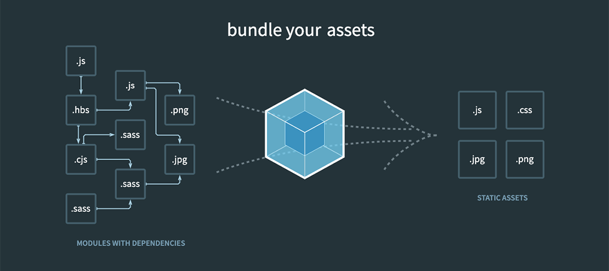
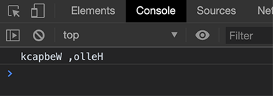
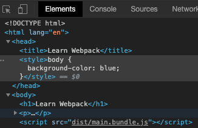
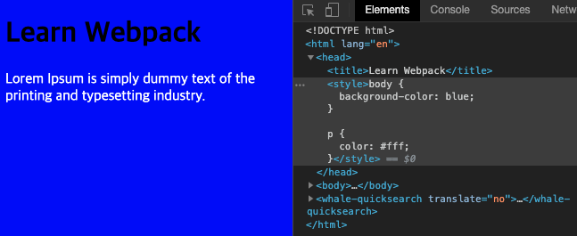
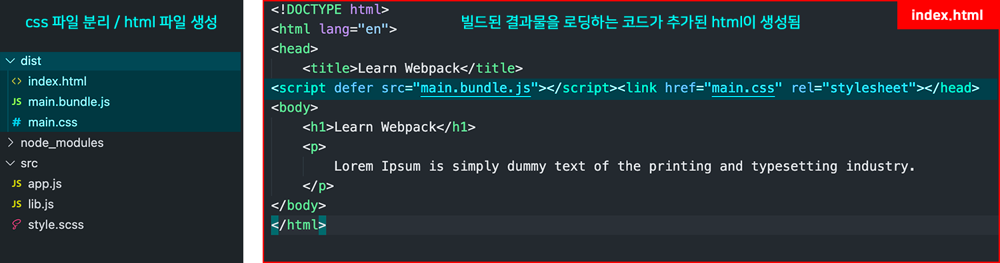

# 웹팩
## 모듈이란?
모듈이란 애플리케이션을 구성하는 개별적인 요소로서 **재사용 가능한 코드 조각**을 말한다.<br/>
모듈은 **기능을 기준으로 파일 단위로 분류**하며, 파일마다 자신만의 **파일 스코프(모듈 스코프)**를 가질 수 있어야 한다. 또한 기본적으로 **캡슐화 되어 비공개 상태**지만, import와 export를 통해 **필요에 따라 다른 모듈에 의해 재사용**될 수 있어야 한다.<br/><br/>
하지만 브라우저 환경에서 자바스크립트는 **파일마다 독립적인 파일 스코프를 갖지않고 모든 자바스크립트 파일이 하나의 전역을 공유**하며, 
**import와 export도 지원하지 않았다.** ES6 이후부터는 **ESM(ES6 Modules)**이 등장해 모듈 시스템을 제공하지만 **IE를 포함한 구형 브라우저에서는 동작하지 않고**, ESM을 사용하더라도 **트랜스파일링이나 번들링이 필요한 것은 변함 없기 때문에 별도의 모듈 로더를 사용하는 것이 보편적**이다.<br/>
- 참고로 Node.js는 CommonJS를 채택해 모듈 시스템을 지원한다.

## 모듈 번들러, 웹팩

<br/>
웹팩은 **최신 프론트엔드 프레임워크에서 가장 많이 사용되는 모듈 번들러**이다.<br/>
자바스크립트에 국한되지 않고 웹 애플리케이션을 구성하는 **모든 자원(js, css, image 등)을 모두 각각의 모듈**로 보기 때문에 import 키워드로 자원을 불러올 수 있고, 이를 조합해서 **병합된 하나의 결과물**로 만들어준다.<br/>
모듈의 시작점인 **Entry Point를 설정하면 이를 시작으로** 의존 관계를 맺은 자원들을 하나씩 찾아 번들링해 결과물인 **하나의 Output**을 만들어낸다.<br/> 
웹팩을 사용하면 의존 모듈들이 **하나의 js 파일로 번들링**되기 때문에 **별도의 모듈 로더가 필요하지 않으며**, 여러개의 파일을 로드하지 않아도 되기 때문에 **네트워크 통신 횟수도 줄어들어 웹 애플리케이션의 성능 향상**에도 도움이 된다. 

- 모듈 번들링 : 웹 애플리케이션을 구성하는 수많은 **자원들의 의존 관계를 파악하여 하나의 파일로 병합 및 압축해주는 동작**을 말한다.


# 웹팩 사용해보기
### 1. 프로젝트 생성
프로젝트 폴더를 생성하고 npm init을 통해 npm 프로젝트 시작을 위한 준비를 해준다.
```shell
# 1. 프로젝트 디렉토리 생성
$ mkdir learn-webpack

# 2. 디렉토리 이동
$ cd learn-webpack

# 3. npm 프로젝트 초기화
$ npm init -y
```

### 2. 패키지 설치
```shell
# 터미널에서 웹팩 명령어를 사용하기 위해 webpack-cli로 함께 설치한다.
$ npm i webpack webpack-cli -D
```

### 3. 샘플 코드 작성
src 디렉토리를 만들고 아래 샘플 코드 파일을 생성한다.
```javascript:title=src/lib.js
export function reverseStr(str) {
  return str.split('').reverse().join('');
}
```
```javascript:title=src/app.js
import {reverseStr} from './lib';

console.log(reverseStr('Hello, Webpack'));
```

그리고 이를 브라우저에서 확인하기 위해 index.html을 만들어준다.
```html:title=index.html
<!DOCTYPE html>
<html lang="en">
<head>
    <title>Learn Webpack</title>
</head>
<body>
    <h1>Learn Webpack</h1>
    <p>
        Lorem Ipsum is simply dummy text of the printing and typesetting industry. 
    </p>
</body>
</html>
```

### 4. script 추가
웹팩 빌드 명령어를 실행하기 위해 package.json에 스크립트를 추가한다.
```json:title=package.json
"scripts": {
  "build": "webpack --entry ./src/app.js --mode development"
}
```

참고로 package.json에 스크립트를 추가하지 않고, 프로젝트 내부의 명령어 파일에 직접 접근해 실행하는 방법도 있다.<br/>
```shell
$ node_modules/.bin/webpack --entry ./src/app.js --mode development
```
package.json에 스크립트를 추가하면 먼저 프로젝트 내부에서 패키지를 검색하고, 존재하지 않으면 전역에 설치된 패키지를 찾아 실행한다.


### 5. build 하기
```shell
$ npm run build
```
그리고 index.html에서 빌드된 js 파일을 로드 할 수 있도록 추가해준다.
```html:title=index.html
<!DOCTYPE html>
<html lang="en">
<head>
    <title>Learn Webpack</title>
</head>
<body>
    <h1>Learn Webpack</h1>
    <p>
        Lorem Ipsum is simply dummy text of the printing and typesetting industry. 
    </p>
    <script src="dist/main.bundle.js"></script>
</body>
</html>
```

### 6. output 확인하기
dist 폴더에 main.js 라는 이름으로 번들링 된 파일이 생성되었다.

```javascript:title=dist/main.js
(() => { // <- 모든 코드를 즉시 실행 함수로 감싸고 있다.
// ..........중략..........
...
/* 0 */, 
/* 1 */ // <- 번호가 달려있다
function reverseStr(str) { // <- lib.js에서 export 한 함수
    return str.split('').reverse().join('');
} 
// ..........중략..........

console.log((0,_lib__WEBPACK_IMPORTED_MODULE_0__.reverseStr)('Hello, Webpack'));
// ..........중략..........
})();
```

index.html을 브라우저에 띄워보면 소스 코드에 작성한 콘솔 로그도 정상 출력된다.



<br/>

# 웹팩 설정 파일로 분리하기
웹팩의 많은 옵션을 명령어와 함께 기술하는 것은 비효율적이고 가독성에 좋지 않다.<br/>
웹팩은 기본적으로 ``webpack.config.js`` 파일 명으로 설정 파일을 분리 할 수 있도록 제공해준다.<br/>
프로젝트 루트 디렉토리에 webpack.config.js를 추가한다.
```javascript:title=webpack.config.js 
const path = require('path');

module.exports = {
    mode : 'none',
    entry : './src/appjs',
    output : {
        filename : '[name].js',
        path : path.resolve(__dirname, 'dist') // os마다 절대 경로가 다르기 때문에 path 모듈을 사용해 경로를 지정함
    }
}
```

그리고 package.json에서 build 스크립트의 명령어에 주는 설정 옵션을 제거한다.
```json:title=package.json
"scripts": {
  "build": "webpack"
}
```

# 자주 쓰이는 웹팩 설정
## 1. mode
mode는 'none', 'production', 'development' 3가지 모드를 지원한다.<br/>
디폴트로 'production' 모드로 설정되어 있으며, **설정된 각 mode에 맞게 최적화**를 진행해준다.<br/>
```javascript:title=webpack.config.js 
module.exports = { 
  mode: 'development' // 'none' | 'production' | 'development'
};
```

## 2. entry
웹팩에서 번들링 작업을 시작하기 위해 필요한 **최초 진입점**이자 자바스크립트 파일 경로이다.<br/>
**entry 파일을 시작점으로 의존 관계를 가진 모듈들을 번들링**해준다.<br/>
기본 값은 ``./src/index.js`` 이지만 다른 진입점을 설정해 줄 수 있다.
```javascript:title=webpack.config.js 
module.exports = {
    entry : './src/app.js',
}
```

여러개의 Entry Point를 설정해 코드 스플리팅을 하고 싶다면, entry 프로퍼티 값을 객체로 설정한다.
```javascript:title=webpack.config.js 
module.exports = {
    entry : {
      main : './src/index.js',
      lib : './src/lib.js',
    }
}
```

## 3. output
웹팩으로 번들링하고 난 후 생성되는 **결과물 파일에 대한 설정**이다.<br/>
주로 filename과 path 값이 사용된다.
```javascript:title=webpack.config.js 
const path = require('path');

module.exports = { 
  output : { 
    filename : '[name].js',
    path : path.resolve(__dirname, 'dist') 
  }
};
```

### filename
output 파일의 이름은 여러 방식으로 지정할 수 있다.
1. entry 이름

```javascript:title=webpack.config.js 
module.exports = {
  output: { 
    filename: '[name].bundle.js' 
  }
};
```
2. 웹팩 내부적으로 사용하는 모듈 ID

```javascript:title=webpack.config.js 
module.exports = {
  output: { 
    filename: '[id].bundle.js' 
  }
};
```

3. 빌드 마다 생성되는 고유 해시 값

```javascript:title=webpack.config.js 
module.exports = {
  output: { 
    filename: '[name].[hash].bundle.js' 
  }
};
```

4. 웹팩의 각 모듈 내용을 기준으로 생생된 해시 값을 붙이는 옵션

```javascript:title=webpack.config.js 
module.exports = {
  output: { 
    filename: '[chunkhash].bundle.js' 
  }
};
```
동일한 이름으로 파일이 빌드되면 브라우저에 남은 캐시 때문에 변경된 파일이 반영되지 않을 수 있다.<br/>
그럴 때마다 사용자가 브라우저의 캐시를 삭제해줘야 하는데, 파일 이름애 chunkhash 해시값을 주면 캐시를 무력화 할 수 있다.

## 4. loader
웹 애플리케이션을 **해석(파일 간의 연관 관계를 파악)하는 과정에서 자원(javascript, css, image 등)들을 변환할 수 있도록 도와주는 속성**이다.
**import 키워드를 통해 자바스크립트 외의 자원을 자바스크립트 코드로 불러와 사용할 수 있는 것**도 바로 이 로더 덕분이다.<br/>
로더는 Typescript나 Sass와 같이 트랜스 파일링이 필요한 언어의 트랜스 파일러로서 동작하기도 하고, 이미지를 data URL 형식의 문자열로 변환해주기도 한다.
또한 CSS 파일을 자바스크립트에서 직접 로딩할 수 있도록 해준다.

```javascript:title=webpack.config.js 
module.exports = {
  module: {
    rules: [
      {
        test: /\.css$/,
        use: ['style-loader', 'css-loader']
      }
    ]
  }
};
```
rules 프로퍼티 값으로 test와 use 프로퍼티를 가진 객체를 배열에 넣어주면 된다.
- ``test`` : 로더의 변환 대상이 될 파일 식별자 명
- ``use`` : 변환을 수행하는데 사용할 로더로서, 여러개의 로더가 사용될 경우 순서가 매우 중요하다.<br/>
  오른쪽에서 왼쪽 로더 순서로 동작한다.

### 예제 1. css 모듈로 사용하기
#### 1. 패키지 설치

```shell
# 로더 설치
$ npm install css-loader style-loader -D
```
- ``css-loader`` : css를 js에서 load 할 수 있게 해준다.
- ``style-loader`` : js로 변경된 스타일 시트를 동적으로 DOM에 추가해준다.

#### 2. 샘플 코드 작성
1. css 파일 작성

```css:title=src/style.css
body {
    background-color: blue;
}
```

2. css 파일을 import 한다.

```javascript:title=src/app.js
import './style.css';
```

#### 3. webpack 설정 추가
```diff:title=webpack.config.js
const path = require('path');

module.exports = {
    mode : 'none',
    entry : './src/app.js',
    output : {
        filename : '[name].bundle.js',
        path : path.resolve(__dirname, 'dist')
    },
+   module :{
+       rules : [
+           {test : /\.css/g, use : ['style-loader', 'css-loader']}
+       ]
+   }
}
```
css 파일을 javascript 코드에서 불러오고 DOM에 적용하는 것은 그 후의 몫이기 때문에,<br/>
css-loader가 먼저 실행되고 그 후에 style-loader가 실행되어야 한다.


#### 4. build 후 결과 확인하기
스타일시트가 head 태그 안에 inline 속성으로 들어가있다.



### 예제 2. sass 적용
#### 1. 패키지 설치

```shell
# 1. sass 설치
$ npm install sass -g

# 2. 로더 설치
$ npm install sass-loader -D
```

#### 2. 샘플 코드 작성
1. css 파일을 scss로 변경해주고 코드를 추가한다.

```scss:title=src/style.scss
$font-color : #fff;

body {
    background-color: blue;
}

p {
    color : $font-color;
}
```

2. scss 파일을 import 한다.

```javascript:title=src/app.js
import './style.scss';
```

#### 3. webpack 설정 추가
sass-loader를 추가하고 대상이 되는 파일 확장자를 변경해준다.
```diff:title=webpack.config.js
const path = require('path');

module.exports = {
    mode : 'none',
    entry : './src/app.js',
    output : {
        filename : '[name].bundle.js',
        path : path.resolve(__dirname, 'dist')
    },
+   module :{
+       rules : [
+           {test : /\.(scss|css)/g, use : ['style-loader', 'css-loader', 'sass-loader']}
+       ]
+   }
}
```
scss 파일을 css 파일로 컴파일해야 하기 때문에 sass-loader가 제일 먼저 실행되어야 한다.

#### 4. build 후 결과 확인하기


<br/>

## 5. plugin
로더가 파일을 해석하고 변환하는 과정에 관여하는 반면, 플러그인은 **웹팩의 기본적인 동작에 추가적인 기능을 제공하는 속성**으로 **번들링 된 결과물의 형태를 바꿔주는 역할**을 한다.<br/>
### 예제
지금까지는 css 코드가 빌드된 결과물인 js 코드 내에 들어가 있었다. 개발 규모가 커지면 코드가 길어지고 그 결과 파일 사이즈도 커지기 때문에 css 파일을 따로 분리할 필요가 있다. 또한 index.html에서 빌드된 결과물을 로딩하는 코드를 수동으로 작성했지만, 플러그인을 사용하면 빌드 결과물이 동적으로 로딩되는 html 파일을 생성 할 수 있다.

#### 1. 패키지 설치
```shell
$ npm install mini-css-extract-plugin html-webpack-plugin -D
```
- ``mini-css-extract-plugin`` : css 코드만 추출해 파일을 분리시켜주는 플러그인
- ``html-webpack-plugin`` : 웹팩으로 빌드한 결과물로 HTML 파일을 생성해주는 플러그인

#### 2. webpack 설정 추가
```diff:title=webpack.config.js 
+ const HtmlWebpackPlugin = require('html-webpack-plugin');
+ const MiniCssExtractPlugin = require('mini-css-extract-plugin');
const path = require('path');

module.exports = {
    mode : 'none',
    entry : './src/app.js',
    output : {
        filename : '[name].bundle.js',
        path : path.resolve(__dirname, 'dist') // os마다 절대 경로가 다르기 때문에 path 모듈을 사용해 경로를 지정함
    },
    module :{
        rules : [
            {
              test : /\.(scss|css)/g, 
              use : [
+               MiniCssExtractPlugin.loader,
-               'style-loader'
                'css-loader', 'sass-loader'
              ]
            }
        ]
    },
    plugins : [
+        new MiniCssExtractPlugin(),
+        new HtmlWebpackPlugin({template: './index.html'})
    ] 
}
```
css 파일을 분리함으로서 js 코드 안의 스타일 시트를 동적으로 DOM에 추가해주는 작업이 필요 없어졌으므로 style-loader를 제거하고, MiniCssExtractPlugin에서 제공하는 loader를 추가해주었다.

#### 3. build 후 결과 확인하기



# 웹팩 데브 서버
프론트엔드 개발환경에서 **개발용 서버를 제공해 주는 것이 Webpack Dev Server**다.<br/>
지금까지는 소스 코드가 변경될 때 마다, 다시 webpack 명령어로 build 하고 브라우저를 새로고침 해 결과물을 확인하는 번거로운 과정을 거쳤다.<br/>
웹팩 데브 서버를 사용하면 **코드를 변경 한 후 저장하였을 때, 자동으로 빌드 후 브라우저를 새로고침**해준다.<br/><br/>

웹팩 데브 서버는 웹팩에 내장되어 있지 않다. 따로 웹팩 데브 서버 패키지를 설치해줘야 한다.

### 1. 패키지 설치
```shell
$ npm install webpack-dev-server -D
```

### 2. script 추가
```json:title=package.json
"scripts": {
  "start": "webpack-dev-server"
}
```

### 3. 서버 실행
```shell
$ npm run start

ℹ ｢wds｣: Project is running at http://localhost:8080/
ℹ ｢wds｣: webpack output is served from /
ℹ ｢wds｣: Content not from webpack is served from ${프로젝트 경로}
ℹ ｢wdm｣: asset main.bundle.js 342 KiB [emitted] (name: main)
```
소스 코드를 수정하고 저장하면 변경된 소스 코드가 즉시 반영되는 것을 알 수 있다.

## 동작 방식
웹팩 데브 서버를 실행하여 웹팩 빌드를 하는 경우, 빌드한 결과물이 파일 탐색기나 프로젝트 폴더에 보이지 않는다.<br/>
웹팩 데브 서버는 빌드한 결과물을 **메모리에 저장하고 따로 파일을 생성하지 않는다.** 인메모리 기반으로 결과물을 관리하고 변경되는 즉시 반영하기 때문에 DISK I/O 보다 더 
빠르고 컴퓨터 자원을 덜 소모하는 방식으로 동작한다.

## 설정
``webpack.config.js`` 파일에서 devServer 프로퍼티에 설정 값을 줄 수 있다.<br/>
설정 값 종류는 [Webpack Document - DevServer](https://webpack.js.org/configuration/dev-server/)를 참고한다.
```javascript:title=webpack.config.js 
module.exports = {
  devServer: {
    port: 9000, // 개발 서버 포트 번호
  }
};
```


# Reference
- [프론트엔드 개발자를 위한 웹팩 강의](https://inf.run/mnQW)
- [김정환님의 프론트엔드 개발환경의 이해](https://jeonghwan-kim.github.io/series/2019/12/09/frontend-dev-env-npm.html)
- [모던 자바스크립트 Deep Dive](http://www.yes24.com/Product/Goods/92742567)