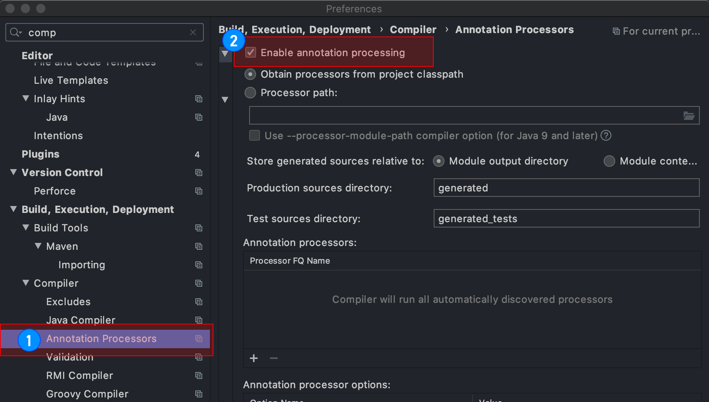

> 🔒 작성중

# 0. 개발 환경
- OS : Mac OS Catalina
- IDE : IntelliJ 2019.3

# 1. 프로젝트 생성
[Spring initializr](https://start.spring.io/)에 접속하여 프로젝트를 생성한다.

## 1.1. 프로젝트 설정
- Build tool : Gradle
- Language : Java 11
- Spring Boot Version : 2.3.2
- Packaging : jar

### 필요한 의존성
- Spring Web
- Spring Data JPA
- MySQL Driver
  - 개발 환경에 맞는 JDBC Driver 선택
- Lombok
- Thymeleaf

#### Lombok 세팅
1. IDE에서 Lombok을 처음 사용할 경우, Lombok 플러그인 설치 
2. IDE 설정  
  Preferense > Compiler > Annotaion Processors에서 ``Enable Annotaion processing`` 체크 
<!--  -->

<!-- # # Reference  -->
